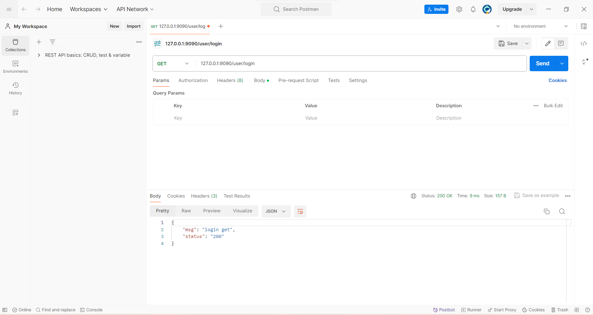
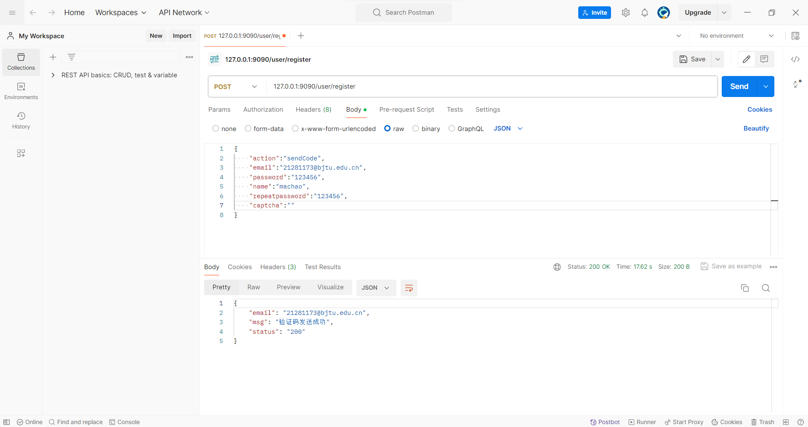
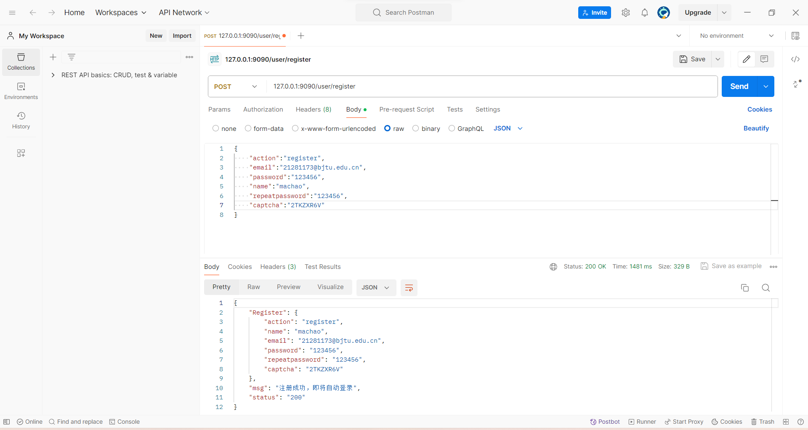
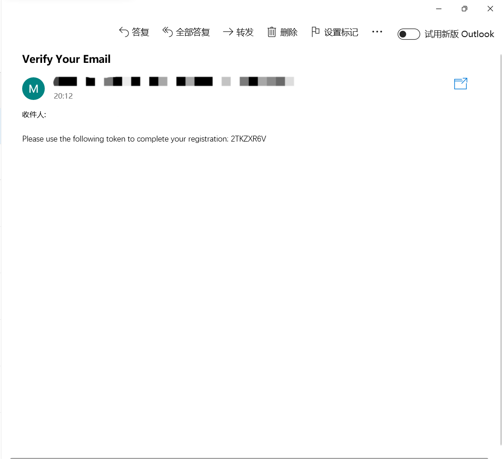

# 项目简介
**项目名称：快餐店点餐**

**本项目是一个快餐店点餐网站开发，主要功能是用户通过线上点餐然后去线下自提**
****
**本项目主要灵感来自于类似于蜜雪冰城，肯德基，麦当劳等快餐店的微信小程序。**
## 项目结构

```markdown
Restaurant/
│
├── conf/ // 项目需要进行配置的一些信息
│ └──config.yaml // 具体配置文件
├── constant/ // 存放一些基础的常量，错误，常量等
│ └──
│
├── controller/ // 路由控制层
│ ├── user.go // 用户的路由控制
│ ├── menuController.go // 用户点餐的路由控制
│ ├── orderController.go // 订单的路由控制，商户以及用户一致
│ └── productController.go // 商户对于餐品的路由控制
│
├── dao/ // 数据库操作层
│ ├── mysql/ // MySQL数据库的具体操作
	├── mysql.go // mysql数据库的初始化
│ └── redis/ // redis数据库的初始化
	├── redis.go // redis数据库的初始化
│
├── data/ //数据缓存位置，groupCache
│ └── groupCache.go // 后续考虑是否添加，redis进行数据缓存也较为不错
│
├── log/ //日志配置以及日志存储位置
│ ├── logger.go //配置zap库用于日志记录，还支持自动分割日志
│ └── // 其余位置存储项目日志
│
├── logic/ //逻辑控制层
│ ├── user.go // 此处主要实现登录以及注册的逻辑
│ ├── wechatApi.go // 此处主要实现微信支付api的调用，但是由于无法开通微信商户，故只写了一个简单的模拟，且需要在微信支付的时候进行修改
│ └── order.go // 实现点餐以及订单生成的逻辑
│
├── models/ // 存储数据模型以及sql建表文件
│ ├── customer.go // 
│ ├── merchant.go // 
│ ├── order.go // 
│ ├── payment.go // 
│ └── product.go // 
├── pkg/ //存放一些第三方的库
│ └── 
│
├── router/ //路由配置层
│ └── router.go // 整体的路由配置
│
├── setting/ //项目初始化设置
│ └── setting.go // 初始化配置
│
├── static/ //前端静态文件存储位置
│ ├── css
│ ├── image
│ └── js
│
├── templates/ //前端模板存储位置
│ ├── index.html // 前端主入口
│ └── ....... // 其余html文件
│
│
├── .air.conf // 热重载
├── go.mod // 包的管理
├── main.go // 项目入口
├── LICENSE // 项目许可证
└── README.md // 项目概述和使用说明

```
## 项目功能

**1.用户端的实现及管理**
- 用户注册登录
- 用户密码找回
- 用户点餐
- 用户订单管理

**2.商家端的实现及管理**
- 商家注册登录
- 商家密码找回
- 商家商品管理
- 商家订单管理

**3.点餐功能的实现**
- 线上点餐

**4.订单管理**
- 订单的生成
- 
~~- 订单的支付~~
~~- 订单的取消~~
~~- 订单的退款~~

**5.商品管理**
- 商品的增删改查
- 商品的分类
- 
~~- 商品的推荐~~
## 项目技术栈

**1.前端技术栈**
- 不太会前端，目前只完成了后端部分

**2.后端技术栈**
- MySQL
- Redis
- gin框架
- gorm框架
- websocket
- zap库记录日志
- viper库读取配置文件


## 项目部署

~~- 使用Docker部署~~

## 项目展示
- 本项目后端测试使用postman进行测试




## 项目总结
**使用Gin框架搭建后端API用于处理用户或者商户的登录，订单管理等任务。使用
MySQL数据库进行数据持久化处理， 并且使用Redis实现餐品销
量排序的功能。使用WebSocket进行实时信息的更新，如订单状态，实时通知等**
